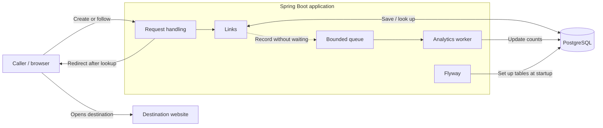

# Architecture

- **Built:** application startup, health check, database and versioned table setup.
- **Agreed design below:** link handling and analytics are not implemented yet.

## How it works

- **Create:** validate input; replay matching retries and reject conflicting reuse. For a new request ID, generate a code and commit the result before responding.
- **Follow:** look up the code, check eligibility and return the destination. The browser opens it; the service does not fetch it.
- **Record:** analytics runs separately so recording trouble does not hold up a valid redirect.

## Agreed API, not built

- `POST /api/v1/links`: `destinationUrl` plus UUID `Idempotency-Key`; new result returns 201, `Location`, and `code`, `shortUrl`, `destinationUrl`.
- `GET /r/{code}`: 302, destination `Location`, `Cache-Control: no-store`.
- Errors: 400 invalid input; 404 unknown code; 409 conflicting request-ID reuse; 503 unavailable storage.

## Choices, tradeoffs and risks

- **One app and database:** easy local setup; database failure can still stop redirects.
- **Spring JDBC and Flyway:** explicit queries and controlled table changes. Add new migrations; do not rewrite applied ones.
- **Ten-character random codes:** [database constraints](../src/main/resources/db/migration/V1__create_short_links.sql) enforce uniqueness; bounded collision retries and request-ID replay still need code.
- **Fixed destinations and saved original short URLs:** stable replay; no editing or early revocation. Retained records can grow without cleanup.
- **Bounded background analytics:** responsive redirects; counts may lag or lose unrecorded events.
- **Local access by default:** convenient testing, not safe public deployment. URL validation cannot establish whether a destination is trustworthy.

Versions and setup: [README](../README.md). Security patch rationale: [AI-human log](ai-log.md#tomcat-patch-decision).
