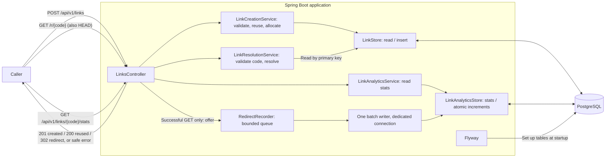

# Architecture

- **Built:** startup, health check, versioned table setup and link creation with destination reuse, following short links, and best-effort redirect analytics.
- **Deferred:** expiration, API-key protection and deployment. Local performance evidence is recorded in [testing](testing.md#redirect-performance-baseline).

## How it works

- Validate the destination, look it up by fingerprint and compare the full string before reuse.
- If absent, generate a ten-character random code and attempt a conflict-safe insert. The insert commits before returning a created outcome.
- After a conflict, read the committed destination winner. If none exists, retry code generation up to five candidates. The controller alone chooses HTTP status; no in-memory lock or reuse cache is needed.

## Creation contract

- `POST /api/v1/links`: JSON containing only `destinationUrl`. Reject unknown fields and any `Idempotency-Key` header, including empty values and case variants, with safe 400 errors.
- New mappings return 201; exact destination reuse returns 200. Both return `Location` and `code`, `shortUrl`, `destinationUrl`.
- Destination: absolute HTTP(S), host required, at most 2,048 UTF-16 code units; no credentials or raw whitespace/control characters. Reject malformed URLs, unpaired Unicode surrogates and invalid ports; international hostnames use ASCII/punycode. Valid Unicode paths and local addresses are allowed. No destination is fetched.
- Preserve destination strings exactly, without trimming or normalization. Save the original short URL from validated `shortener.base-url`, never request headers; reuse survives restart and base changes.
- Errors use JSON `status`, `title`, safe `detail`: 400 invalid request; 503 storage failure, mismatched fingerprint candidate or exhausted code candidates. Retry 503 with the same destination: a lost response can hide a committed write.
- Database waits are bounded: pool acquisition, connection establishment and SQL statements use three seconds; socket reads use five; cancellation uses one. These are individual limits, not an end-to-end latency guarantee. [Driver timeout reference](https://jdbc.postgresql.org/documentation/use/).

## Redirect contract

- `GET /r/{code}` returns 302, the saved destination in `Location`, `Cache-Control: no-store`, and an empty body. Spring handles HEAD automatically with the same status and headers but no body, including on errors.
- Codes are exactly ten case-sensitive ASCII letters or digits. Malformed codes fail before storage access; unknown codes also return 404 with the existing safe JSON `status`, `title`, `detail` fields.
- Storage failures return 503 and “Retry the same request.” Redirect errors carry `no-store` and no `Location`; the existing database timeouts also apply to lookup.
- `LinkResolutionService` validates and resolves; `LinkStore.findByCode` performs a parameterized primary-key read using the shared row mapper. Resolution does not write, cache or fetch anything. Base-URL changes do not affect lookup of saved codes.
- The controller preserves ASCII and existing percent escapes, and percent-encodes only non-ASCII UTF-8 bytes. It avoids `URI.toASCIIString()` to preserve decomposed Unicode. Stored text and creation/reuse responses remain unchanged.
- Tomcat's response-header allowance is 32 KB: an accepted 2,048-code-unit destination can expand beyond 18 KB after encoding. The long Unicode HTTP test covers this; request limits and destination validation are unchanged.

## Analytics contract

- `GET /api/v1/links/{code}/stats` returns `code`, `redirectCount` and `lastRedirectedAt`, with `Cache-Control: no-store`. A saved link without an analytics row returns zero/null. The timestamp is UTC; malformed/unknown codes return safe 404, and unavailable stats storage returns safe 503. Codes remain case-sensitive.
- Only GET redirects count, after successful resolution and construction of the 302 response. HEAD, creation/reuse, stats reads and errors do not. Bots, retries and repeated requests count; receipt by the browser and destination visits are not observable here. Reuse retains the original link's stats.
- `RedirectRecorder` offers an event to a 10,000-event queue without waiting for space or performing database work. One worker combines at most 1,000 events, waiting at most 250 ms to form a batch. Backlogs can make visibility lag longer. Each atomic upsert adds counts and takes the maximum recorded timestamp, with keys sorted to give concurrent writers consistent lock order.
- `JdbcAnalyticsWriter` owns a lazy Hikari pool (maximum one connection, zero minimum idle), copying the primary datasource's resolved URL, credentials, driver properties and connection/validation timeouts. It is not another Spring DataSource bean, so Boot still configures the normal pool. SQL retains its three-second deadline. Separate pools isolate connection exhaustion, but both still share PostgreSQL resources; database failure can stop link resolution.
- A full queue drops the new event. Failed batches are marked **unconfirmed**, because a missing acknowledgement can hide a committed write; they are never retried. Counts are eventually consistent and best effort, not an audit ledger. Previously served traffic cannot be reconstructed.
- Micrometer exposes internal `shortener.analytics.events` counters tagged by outcome (`submitted`, `confirmed`, `queue_full`, `shutdown`, `unconfirmed`), plus `shortener.analytics.queue.depth` and `shortener.analytics.in.flight` gauges. These are process-local and reset at restart. Aggregate warnings are rate-limited to one per ten seconds, without codes, destinations or raw database errors. Actuator's HTTP exposure remains health-only; this increment adds no public metrics endpoint or exporter.
- Shutdown stops admission, allows five seconds to drain, then discards queued work and closes the writer/pool, with a total fifteen-second recorder deadline. A stuck driver may finish daemon cleanup later; counters identify discarded/unconfirmed events. Abrupt process loss can lose queued events. Successfully persisted totals survive restart. No per-request events, IP addresses, user agents or referrers are stored.

## Responsibilities

One `links` module uses constructor injection and these packages:

| Package | Responsibility |
| --- | --- |
| `controller` | HTTP input, status/headers, destination header encoding and safe error translation |
| `model` | Separate request, response, saved link and creation outcome records |
| `service` | Creation, resolution and stats validation/lookup; bounded creation retries |
| `dao` | SQL, row mapping, code lookup, fingerprint lookup/full comparison and storage-failure translation |
| `validation` | Destination URL and short-code rules |
| `analytics` | Bounded admission, batch recording, diagnostics and owned writer lifecycle |
| `generator` | Secure random short codes; a supplier seam permits forced test collisions |
| `exception` | `LinkFailure` reasons (invalid input, not found, unavailable) without HTTP or SQL details |
| `config` | Validated base URL and dependency wiring |

## Persistence and migration

[V1](../src/main/resources/db/migration/V1__create_short_links.sql) stays unchanged. [V2](../src/main/resources/db/migration/V2__enforce_destination_reuse.sql) preserves every original field, adds a database-generated [UUID default](https://www.postgresql.org/docs/17/functions-uuid.html) for internal `creation_request_id`, and backfills `destination_hash` using PostgreSQL’s built-in [SHA-256 and UTF-8 conversion](https://www.postgresql.org/docs/17/functions-binarystring.html).

The fingerprint is required, unique and checked against the stored destination. A fixed 32-byte index key avoids [B-tree entry-size limits](https://www.postgresql.org/docs/17/btree.html) for long Unicode URLs. Full-string comparison prevents incorrect reuse even if two destinations share a fingerprint.

Flyway runs V2 transactionally, with a three-second lock wait and thirty-second statement limit. Duplicate destinations or fingerprint conflicts abort and roll back the migration without deleting or merging mappings. A database containing such rows needs an explicit data-resolution decision before upgrade. Large backfills may exceed the statement limit; migration timing has only been exercised on disposable test data.

[V3](../src/main/resources/db/migration/V3__create_link_analytics.sql) adds `link_analytics` without altering V1/V2 or existing mappings. Its case-sensitive short-code primary key references `short_links`; counts must be positive BIGINTs and timestamps non-null TIMESTAMPTZs. Rows are created lazily on the first recorded batch, so old links initially report zero/null. V3 bounds lock waits to three seconds and statement execution to thirty seconds. Populated V2 migration, constraints and preserved reuse are checked against disposable PostgreSQL.

## Choices, tradeoffs and risks

- **One app and database:** easy local setup; database failure can still stop redirects.
- **Spring JDBC and Flyway:** explicit queries and controlled table changes. Add new migrations; do not rewrite applied ones.
- **Ten-character random codes:** secure random generation plus [database constraints](../src/main/resources/db/migration/V1__create_short_links.sql) enforce unique stored mappings; five attempts bound collision work.
- **Fixed destinations and saved original short URLs:** stable reuse; no editing or early revocation. Retained records can grow without cleanup.
- **Local access by default:** convenient testing, not safe public deployment. URL validation cannot establish whether a destination is trustworthy.

Quality/security gates run outside request handling; see [testing](testing.md#automated-security-and-ci). They add build tools, not application dependencies.

Versions and setup: [README](../README.md). Security patch rationale: [AI-human log](ai-log.md#tomcat-patch-decision).
